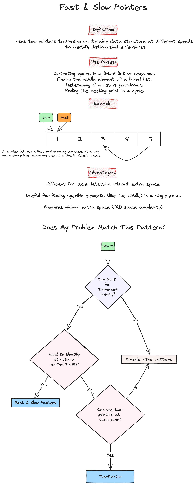
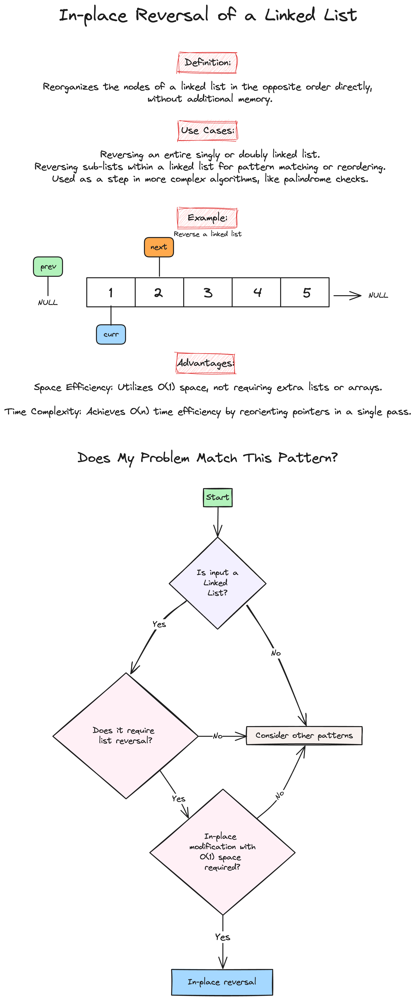
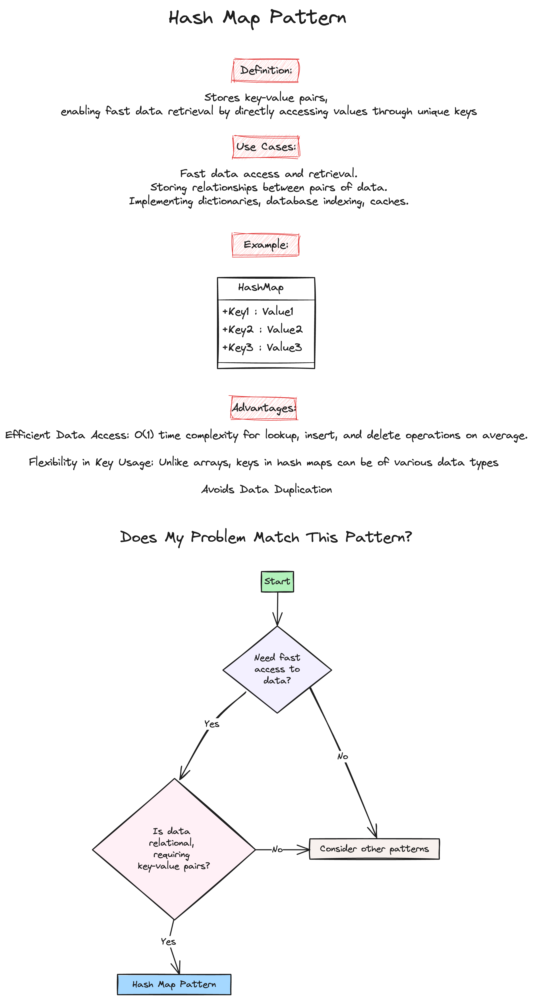

# Week 3: Hashing and Linked Lists

Welcome to the third week of our LeetCode Bootcamp. This week, we will dive into Linked Lists and Hash Maps, introducing powerful problem-solving patterns.

## Class Agenda (2 Hours)

### Python Overview of Linked Lists and Matrices

Please review the following resources:

- [Programiz: Linked List](https://www.programiz.com/dsa/linked-list)
- [Datacamp: Linked List](https://www.datacamp.com/tutorial/python-linked-lists)
- [Python.org: List Data Structure](https://docs.python.org/3/tutorial/datastructures.html)
- [Exercism: Sets](https://exercism.org/tracks/python/concepts/sets)
- [Exercism: Dicts](https://exercism.org/tracks/python/concepts/dicts)
- [Exercism: Dicts Methods](https://exercism.org/tracks/python/concepts/dict-methods)
- [Python.org: Mapping Types](https://docs.python.org/3/library/stdtypes.html#mapping-types-dict)
- [Python.org: Dictionaries](https://docs.python.org/3/tutorial/datastructures.html#dictionaries)

### 3. Pattern Introduction

- Fast and Slow Pointers 
- In-place Reversal of a Linked List 
- Hash Map Pattern 

### 4. Problems Covered This Week

Will be Updated Soon ...

### 5. Homework Problems 

NOTE: Section 1 people should only use Section 1 Link, and Section 2 should only use Section 2 Link. Both the contests contain the same problems! 

Will be Updated Soon ...

<!-- - [Section 1 Homework Link](www.hackerrank.com/leetcode-bootcamp-spring-2026-section-1-hw-3)
- [Section 2 Homework Link](www.hackerrank.com/leetcode-bootcamp-spring-2026-section-2-hw-3) -->
